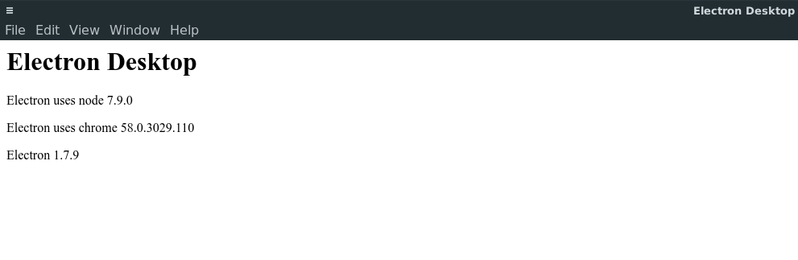

# Electron Desktop Application

## Introduction
I wanted a multi-platform desktop application, but didn't want to use the classic
Mono GTK Sharp and Mono GTK Mac for Mac OS. That's if I went down the C# route,
I also didn't want to couple a server side/console side application with front end
display. I could have used Java and Java Swing or JavaFx or C# DotNet Core, which has
poor GUI options, best I have seen is to use GTK Sharp.

Since all of those require learning new build systems, new techniques and different
languages/builds for each environment, I have deemed it not worth while since I'm not
building a game. I have opted for Electron which is a GitHub tool for creating
Desktop GUI's using nodejs and works on Mac OS, Linux and Windows.

Visual Studio Code and the Atom Editor are both buit on it. Electron only requires
HTML, CSS and JavaScript knowledge to actually build a front end GUI. It runs a
Chromium browser for each window, but there has to be a main window which is the
entry point for your code.

It is not like Apache's Cordova, which is an enclosed system, yes the both run
off NodeJS, but Cordova blocks your code from running NodeJS APIs while Electron
would not be able to useful without allowing you to run NodeJS APIs. This is 
why I think Electron is better. You can use your NodeJS skills or learn them either
way it's less to learn but can be used for more than one porject.

I will do a multi-platform including Mobile using Electron in another project.

[To read more please visit the Electron Website](https://electron.atom.io/)

## About this Project
I put this project within my JavaScript repository because this really wasn't about
electron but more about Gulp and a build system for Electron through Gulp. When
going through the Electron Quick Start guide I got annoyed having to manually type
commands into the command line and instead ended up focusing on building a pipeline.

The pipeline should do the following:
1. Clean out the dist folder
2. Do a TypeScript code check using tslint
3. Compile TypeScript
4. Copy the static files from a source folder to a distrubition folder
5. Minify everything to make package deployments smaller for user downlead
6. Test the compiled js
7. Report on unit testing coverage

## Set Up
1. Install NPM, NodeJS
2. [Follow the Quick Start guide.](https://electron.atom.io/docs/tutorial/quick-start/)
* I followed that guide, but got side tracked by Gulp, so didn't take notes.
3. Download a Zip of this project or clone the repo.
4. Open the folder that contains this project.
```bash
cd /fullPathToProject/
```
5. Install dependencies.
```
npm install
```
6. Serve the project.
```
gulp
```

## Result
Up and running Desktop application using HTML, CSS, JS and NodeJS.


## Conclusion
I really liked how easy it was to have an Electron GUI up and running for a desktop.
The Electron Quick Start Guide when compressed and uncompressed is around 24 lines of
code, the TypeScript that I made when compile, compressed and uncompressed is around
30 lines of code, but uses prototype hierarchy which is an added bonus.

If this application tried to scale using TypeScript vs JavaScript I can easily see
the JavaScript file size being much larger, well that is if you don't write OO JS.

I really wanted to create an Electron App that connected to C# DotNet Core consoles
or console that accepted Objects and have a fuly functional application. But got
side tracked by gulp and getting a decent enough system in place to make that process
easier.

The theory was to connect the Front-End to the back using NodeJS child-proccess which
are async, the Windows in Electron are Mult-Proccess so it seems like a match made in
heaven. You can see an examlpe of child-proccess in my [gulpfile](./gulpfile.js).

If we use NodeJS child-proccesses we can swap C# for Java or C++ or PowerShell or 
Bash or Node JS itself.